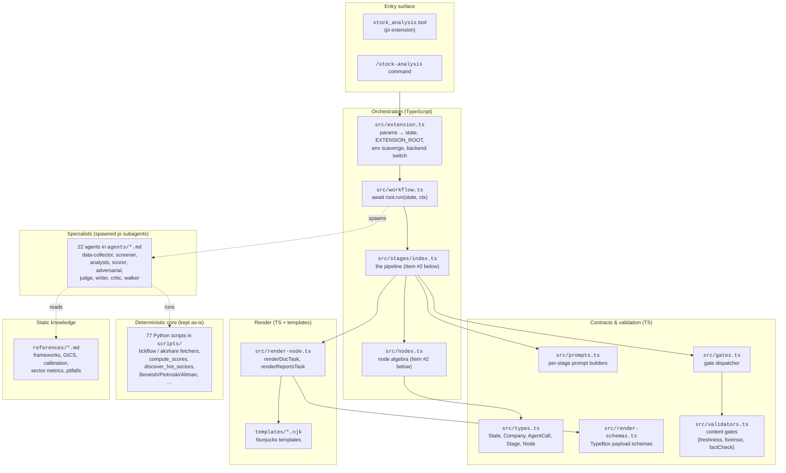

# Architecture

How `pi-stock-analysis` is structured. Three lenses, each answering one
question: *what are the primitives?* → *how do the modes flow?* → *what data
moves through the pipeline?*

If you are new to the codebase, read `src/nodes.ts` alongside
[§2 Node algebra](#2-node-algebra), then `src/stages/index.ts` alongside
[§3 Per-mode stage flow](#3-per-mode-stage-flow). Everything else follows.

---

## 1. Layered view



**Reading rules.** Solid arrows are TypeScript imports (`import { … } from
"./…"`). Dashed arrows are runtime — a spawned agent reads reference docs and
runs Python scripts via `uv run --project ${EXTENSION_ROOT}`.

---

## 2. Node algebra

Every pipeline stage is a `Node` — a tiny interface:

```ts
interface Node {
    kind: string;
    run(state: StockAnalysisState, ctx: StageContext): Promise<unknown>;
}
```

`src/nodes.ts` exports 14 constructors that either wrap a `Stage` (a leaf) or
compose other `Node`s (a combinator). Everything the pipeline does is one of
these.

### Leaves

| Constructor        | Purpose                                                                 |
| ------------------ | ----------------------------------------------------------------------- |
| `task(stage)`      | Wrap any `Stage` (an object with `run(state, ctx)`) as a `Node`.        |
| `writerTask(spec)` | An LLM writer stage: build a prompt, spawn an agent, parse `<control>`. |
| `noop()`           | Does nothing. Useful as a `branch` fallback.                            |
| `wait(ms)`         | Sleep. Aborts if `ctx.signal` fires.                                    |
| `waitForEvent(n)`  | Suspend until a named external event fires.                             |

### Combinators

| Constructor                        | Semantics                                                                                 |
| ---------------------------------- | ----------------------------------------------------------------------------------------- |
| `sequence([...], {tolerant?})`     | Run children in order. `tolerant: true` → a failing child doesn't abort the sequence.     |
| `parallel([...], {concurrency})`   | Run children concurrently, capped at `concurrency`.                                       |
| `branch(pred, {yes, no?})`         | If `pred(state)` → `yes`; else → `no` (or `noop`).                                        |
| `choose([{when, run}, …], other?)` | First case whose `when(state)` returns truthy runs. Otherwise `other`.                    |
| `loop({while, max?}, body)`        | Run `body` while `while(state)` and iterations < `max`.                                   |
| `retry({attempts}, node)`          | Re-run `node` on error/null up to `attempts` times.                                       |
| `gate({validate, attempts, feedbackKey}, node)` | Retry `node` until `validate(state)` passes; write errors into `state.__feedback[feedbackKey]` between attempts. |
| `map({over, as, concurrency, into?}, body)` | For each item in `over(state)`, expose it at `state[as]` and run `body`; collect results at `state[into]`. |
| `tryCatch(body, {onError})`        | Swallow errors from `body`.                                                               |

### Composition example — the per-company DAG

The four-wave dependency DAG (`perCompanyDag` in `stages/index.ts`) is 5
lines that read exactly like the SKILL.md prose:

```ts
const perCompanyDag: Node = sequence([
    parallel([stage5, stage7, stage9, stage13], { concurrency: 4, tolerant: true }),  // wave 1
    parallel([stage6, stage8, stage10, stage14], { concurrency: 4, tolerant: true }),  // wave 2 (6←5, 8←7, 10←5+7, 14←13)
    parallel([stage11, stage12], { concurrency: 2, tolerant: true }),                  // wave 3 (11←10, 12←10)
    branch(companyIsAsh, { yes: stage15, no: noop() }),                                // wave 4 (A-share only)
]);
```

Then `map` fans this out over selected companies with an *independent* second
concurrency dial (ISS-03):

```ts
const perCompanyBlock: Node = map(
    { over: (s) => s.companies, as: "company", concurrency: 4 },
    perCompanyDag,
);
```

`concurrency: 4` on `map` caps **company-level** parallelism. `concurrency: 4`
on the wave-1 `parallel` caps **stage-level** parallelism *within one
company*. Two dials, one place each.

### Gate example — retry with error feedback

```ts
const gateScreening = gate(
    { validate: gateValidator("gate-screening", "stage-4"), attempts: 4, feedbackKey: "screening" },
    task(companyScreenerStage),
);
```

- `validate` reads `state["stage-4"]` and returns `{ ok, errors }` from
  `runHelper("gate-screening")` in `src/gates.ts`.
- On failure, `state.__feedback["screening"] = errors` is set; the next
  attempt's prompt (see `src/prompts.ts::stagePrompt`) prepends
  `## Previous attempt rejected — fix these:`.
- After `attempts: 4` exhausted, the gate logs and continues (non-fatal). The
  pipeline proceeds without pretending validation succeeded.

---

## 3. Per-mode stage flow

Five modes, one root. `ROOT = choose(state.mode)` in `stages/index.ts`.

### 3.1 `pipeline` — full run (default)

```mermaid
flowchart TD
    S0[Stage 0 — Setup]:::stage
    S1[Stage 1 — Data Collection]:::stage
    G15{{gate-shared-data<br/>attempts×4}}:::gate
    S2[Stage 2 — Sub-Industry Screening]:::stage
    S4[Stage 4 — Company Screening]:::stage
    G45{{gate-screening<br/>attempts×4}}:::gate
    MAP[["map concurrency=4<br/>over state.companies"]]:::map
    W1[wave 1 parallel: 5·7·9·13]:::wave
    W2[wave 2 parallel: 6·8·10·14]:::wave
    W3[wave 3 parallel: 11·12]:::wave
    W4{ash?}:::branch
    W4Y[wave 4: 15]:::wave
    W4N[noop]:::stage
    S16[Stage 16 — Scoring]:::stage
    G165{{gate-scoring<br/>attempts×4}}:::gate
    S166[["map concurrency=5<br/>over top-5 scored"]]:::map
    S166b[Stage 16.6 — Adversarial × 3 skeptics]:::stage
    S167[Stage 16.7 — Judge Panel × 4 lenses]:::stage
    G175{{gate-reports<br/>attempts×4}}:::gate
    S17R[Stage 17 — Render report × company × horizon]:::stage
    S174[["map concurrency=4<br/>over state.reports"]]:::map
    S174b[Stage 17.4 — Completeness Critic]:::stage
    G185{{gate-best-picks<br/>attempts×4}}:::gate
    S18R[Stage 18 — Render best-picks]:::stage
    S19[Stage 19 — Cleanup]:::stage

    S0 --> S1 --> G15 --> S2 --> S4 --> G45 --> MAP
    MAP --> W1 --> W2 --> W3 --> W4
    W4 -->|yes| W4Y --> S16
    W4 -->|no| W4N --> S16
    S16 --> G165 --> S166 --> S166b --> S167
    S167 --> G175 --> S17R --> S174 --> S174b
    S174b --> G185 --> S18R --> S19

    classDef stage fill:#e8f4fd,stroke:#4a90e2,color:#1a3a5c
    classDef gate fill:#fff3e0,stroke:#e67e22,color:#5c3a1a
    classDef map fill:#f3e5f5,stroke:#8e44ad,color:#3a1a5c
    classDef wave fill:#e8f5e9,stroke:#27ae60,color:#1a5c3a
    classDef branch fill:#fce4ec,stroke:#c0392b,color:#5c1a3a
```



### 3.2 `screen` — sector screening only

Skips per-company deep-dive, scoring, adversarial, judge. Produces one sector
report per horizon.

```mermaid
flowchart LR
    A[Stage 0]:::stage --> B[Stage 1]:::stage --> C{{gate-shared-data}}:::gate
    C --> D[Stage 2]:::stage --> E[Stage 4]:::stage --> F{{gate-screening}}:::gate
    F --> G{{gate-reports}}:::gate --> H[Stage 17 — Render screening report × horizon]:::stage
    H --> I[Stage 17.4 — Critic]:::stage --> J{{gate-best-picks}}:::gate
    J --> K[Stage 18 — Render best picks]:::stage --> L[Stage 19]:::stage

    classDef stage fill:#e8f4fd,stroke:#4a90e2,color:#1a3a5c
    classDef gate fill:#fff3e0,stroke:#e67e22,color:#5c3a1a
```



### 3.3 `analyze` / `compare` — deep-dive on caller-supplied tickers

Identical shapes. The `compare` mode's uniform-methodology + max-5 rule is
enforced at input validation (`src/helpers.ts::validateParams`), not by a
different node tree.

```mermaid
flowchart LR
    A[Stage 0]:::stage --> B[Stage 1]:::stage --> C{{gate-shared-data}}:::gate
    C --> M[[map over state.companies<br/>4-wave per-company DAG]]:::map
    M --> D[Stage 16 Scoring]:::stage --> G{{gate-scoring}}:::gate
    G --> E[Stage 16.6 Adversarial]:::stage --> F[Stage 16.7 Judge]:::stage
    F --> H{{gate-reports}}:::gate --> I[Stage 17 Render]:::stage
    I --> J[Stage 17.4 Critic]:::stage --> K{{gate-best-picks}}:::gate
    K --> L[Stage 18 Render]:::stage --> N[Stage 19]:::stage

    classDef stage fill:#e8f4fd,stroke:#4a90e2,color:#1a3a5c
    classDef gate fill:#fff3e0,stroke:#e67e22,color:#5c3a1a
    classDef map fill:#f3e5f5,stroke:#8e44ad,color:#3a1a5c
```



### 3.4 `walk` — bottleneck chain from a theme

`roadmap-walker` replaces Stages 2–4. It walks a theme (e.g. "humanoid
robotics") through the supply chain to pick 3–5 bottleneck companies; the rest
of the flow is the same as `analyze`.

```mermaid
flowchart LR
    A[Stage 0]:::stage --> B[Stage 1]:::stage --> C{{gate-shared-data}}:::gate
    C --> W[Stage walk — roadmap-walker]:::stage
    W --> M[[map over top 3-5 candidates]]:::map --> D[Stage 16]:::stage --> G{{gate-scoring}}:::gate
    G --> E[Stage 16.6]:::stage --> F[Stage 16.7]:::stage --> H{{gate-reports}}:::gate
    H --> I[Stage 17]:::stage --> J[Stage 17.4]:::stage --> K{{gate-best-picks}}:::gate --> L[Stage 18]:::stage --> N[Stage 19]:::stage

    classDef stage fill:#e8f4fd,stroke:#4a90e2,color:#1a3a5c
    classDef gate fill:#fff3e0,stroke:#e67e22,color:#5c3a1a
    classDef map fill:#f3e5f5,stroke:#8e44ad,color:#3a1a5c
```



---

## 4. Data flow — what each stage writes to `state`

`state: StockAnalysisState` is the single shared blackboard. Every stage reads
from it, and (for `writerTask` / `renderDocTask`) writes its parsed `<control>`
object into `state[stageId]`. The gate validator reads `state[sourceKey]`.

| Stage    | Writes                                                            | Consumed by                        |
| :------- | :---------------------------------------------------------------- | :--------------------------------- |
| 0        | `state.runId`, `state.reportsDir`, `state.extensionRoot`, `state.tracking` | Every downstream stage             |
| 1        | `state["stage-1"] = { status, files, notes }`                     | gate-shared-data, all analysts     |
| 2        | `state["stage-2"] = { subIndustries }`                            | Stage 4 (company screener)         |
| 4        | `state["stage-4"] = { companies, subIndustries, priceFilterApplied, headroomFilterApplied }` → hydrates `state.companies` | gate-screening, map-over-companies |
| walk     | `state["stage-walk"] = { candidates, chain, roadmap }` → hydrates `state.companies` | map-over-companies                 |
| 5–15     | `state["stage-N"].byTicker[T] = { findings }` (one per company)   | Stage 16 (scorer)                  |
| 16       | `state["stage-16"] = { companies:[{ticker,score,rating,...}] }` → hydrates `state.scoring` | gate-scoring, Stage 16.6           |
| 16.6     | `state.adversarial[T] = { survived, skeptics }`                   | Stage 16.7 (judge)                 |
| 16.7     | `state["stage-16.7"] = { lenses, disagreements, positionType }`   | Stage 17 (report writer)           |
| 17       | `state["stage-17"] = { reports:[{path,horizon,ticker}] }` → hydrates `state.reports` | gate-reports, Stage 17.4, Stage 18 |
| 17.4     | `state.criticFindings[reportPath] = { findings, severity }`       | gate-best-picks                    |
| 18       | writes `HIGHLIGHTS_BEST_PICKS.md` to `state.reportsDir`           | Consumer                           |
| 19       | Deterministic allow-list sweep: deletes `stage_*`/`phase_*`/`raw-data_*` intermediates from `state.reportsDir`; preserves `state.reports[].path` + `HIGHLIGHTS_BEST_PICKS.md` + `workflow-tracking.json` (`src/cleanup.ts`) | —                                  |

**Feedback slot.** `state.__feedback[feedbackKey]` is the retry channel. When
a gate rejects, the next attempt's prompt prepends the specific errors so the
agent fixes the actual failure instead of blind-resampling.

**Rendering slot.** `renderDocTask` and its `renderReportsTask` /
`renderScreeningReportsTask` cousins validate the agent's `<control>` payload
against a TypeBox schema (`src/render-schemas.ts`), then feed it to a Nunjucks
template (`templates/*.njk`), and write the result under `state.reportsDir`.
The template owns *all* structural formatting (001 ranking column, 当前股价
column, Chinese disclaimer), so the agent can never break format — only fail
schema validation, which triggers a retry with feedback.

---

## 5. External surface

Two things a caller ever sees:

1. **The `stock_analysis` tool** (from `pi -e .` or `pi package add`):

   ```
   stock_analysis({
     mode: "pipeline" | "screen" | "analyze" | "compare" | "walk",
     tickers?: string[],   // required for analyze / compare (≥1 / 2-5)
     theme?: string,       // required for walk
     universe?: "US" | "CN" | "ALL",
     days?: 1-20,          // hot-sector focus window
     topIndustry?: number,
     totalCompany?: number,
     topPrice?: number,
     minHeadroom?: number,
     model?: string,       // provider/id override for spawned agents
     maxAgents?: number,   // agent-spawn budget cap
     query?: string,       // free-text passthrough for logging
   }) → { runId, status, mode, reportsDir, reports[], errors[], durationMs, tokenUsage? }
   ```

2. **The `/stock-analysis` slash command** — a thin wrapper that invokes the
   tool with parsed prose. Enabled via
   `pi -e stock-analysis --command stock-analysis`.

Both come from `src/extension.ts`.

---

## 6. Where to make changes

| I want to…                          | Edit                                                                 |
| ----------------------------------- | -------------------------------------------------------------------- |
| Add a stage                         | Write a `Stage`, wrap in `task`/`writerTask`, insert in a `sequence` in `src/stages/index.ts` |
| Change what an agent produces       | Update `src/prompts.ts` (prompt) + `src/render-schemas.ts` (schema if rendered) + the agent's `.md` |
| Add a content gate                  | Add a gate fn in `src/gates.ts` + register in `GATE_DISPATCH`; use `gateValidator("name", "state-key")` |
| Customize the live progress display  | Edit `formatDashboardLines` in `src/extension.ts` (the `setWidget` lines) |
| Change how a report looks           | Edit `templates/*.njk` (never touch the agent — it emits data, not markdown) |
| Add a new mode                      | Compose a new `sequence` and add a `{ when, run }` case to the root `choose` |
| Add a new node primitive            | Add a `Node`-returning function to `src/nodes.ts` and export it       |
| Wire a new deterministic calc       | Add a Python script under `scripts/`, invoke it from an agent prompt via `uv run --project ${EXTENSION_ROOT}` |

The runner (`src/workflow.ts`) is 203 LOC and rarely changes — top of `run` is
literally `await root.run(state, ctx)`.
